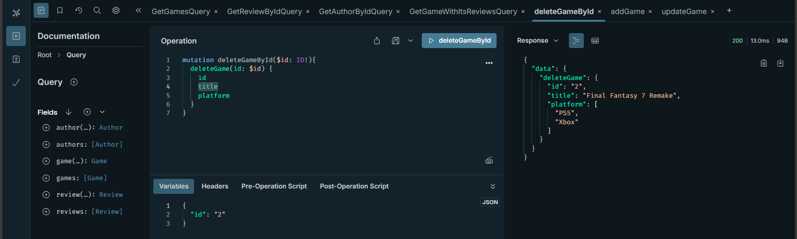

# Learn GraphQL project
#### **Disclaimer**: this project is my practice while learning GraphQL, its main purpose is my note book for GraphQL learning. 
#### Original tutorial coming from this [freeCodeCamp.org](https://www.youtube.com/watch?v=5199E50O7SI&ab_channel=freeCodeCamp.org) youtube channel 

## Setup GraphQL project on local using ApolloServer

1. Follow official [ApolloGraphQL setup link](https://www.apollographql.com/docs/apollo-server/getting-started) (up to step 2, make sure to setup for JavaScript, not TypeScript)
1. Install **GraphQL: Syntax Highlighting** plugin for VisualCode to help life easier when working with GraphQL, check image below to make sure you install the right extension.
1. If needed, you can install nodemon so it can help to restart the local server whenever there is a code change (make sure to enable running scripts on your system and change the command below to *nodemon* instead of *node*)
1. execute below command in the terminal to have the project up and running
    > node index

## Implementation
* Check **schema.js** for nodes definition as well as entry points
* Check **index.js > resolvers** for implementation of handler when there are request to the entry points

*Note:* this project using **_db.js** as a database for GraphQL learning purpose, hence you should expect the content of **resolvers code** to be different from a real production project

## Execute GraphQL queries using Apollo Explorer

Thank you for visiting my little project xD

# THE END